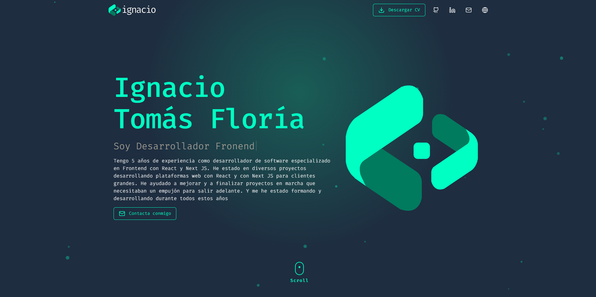

# 🚀 Modern Portfolio

<div align="center">
  
  <p align="center">
    <strong>A high-performance, visually stunning portfolio built with the latest technologies.</strong>
  </p>
</div>

---

## ✨ Overview

This project is a personal portfolio designed to showcase professional experience, projects, and skills with a focus on **user experience**, **smooth animations**, and **clean architecture**. It features multi-language support and a fully responsive design.

## 🛠️ Tech Stack

### Core


### Styling & UI


### Utilities


---

## 🚀 Key Features

- 🌍 **Internationalization (i18n)**: Fully localized content using `next-intl`.
- 🎭 **Smooth Animations**: Powered by `Motion` for a premium interactive feel.
- 📱 **Fully Responsive**: Optimized for all screen sizes from mobile to ultra-wide.
- 🎨 **Modern Design System**: Styled with Tailwind CSS 4.0 for deep customization and performance.
- ⚡ **Next.js 15+ & React 19**: Leveraging the latest features like Server Components and optimal rendering.

---

## 📂 Project Structure

```text
src/
├── app/           # Next.js App Router (i18n enabled)
├── components/    # Reusable UI components
├── i18n/          # Internationalization configuration
├── lib/           # Utility functions and shared logic
├── messages/      # Translation files (JSON)
└── types/         # TypeScript type definitions
```

---

## 📄 License

This project is licensed under the [MIT License](LICENSE).

---

<p align="center">Built with ❤️ by Ignacio</p>
